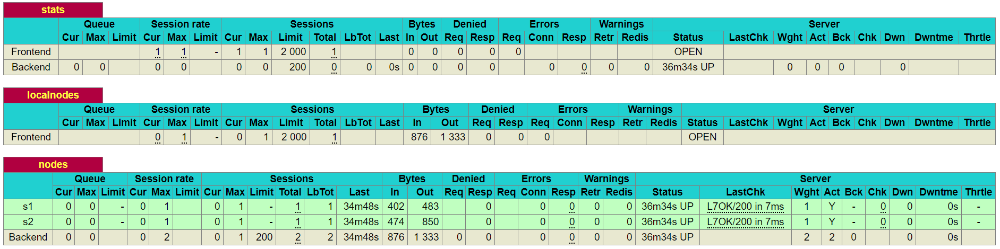
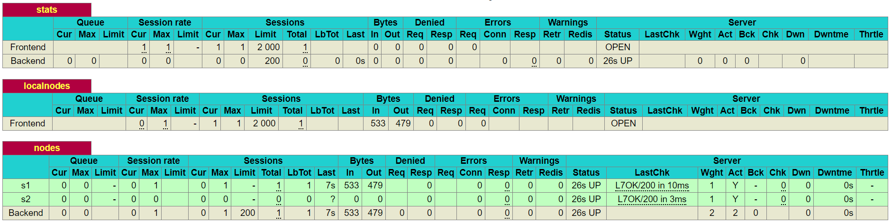
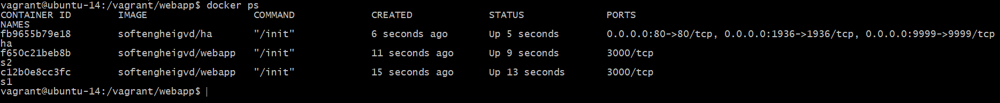
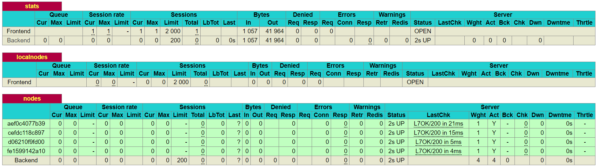
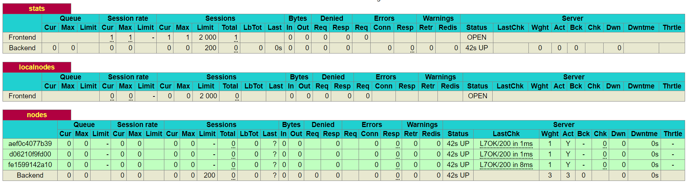

# AIT Lab 04 - Docker

Authors: Labinot Rashiti & Romain Gallay  
Date: 2018-10-12

## Contents  
[Introduction](#introduction)  
[Task 0: Identify issues and install the tools](#task0)  
[Task 1: Add a process supervisor to run several process](#task1)  
[Task 2: Add a tool to manage membership in the web server cluster](#task2)  
[Task 3: React to membership changes](#task3)  
[Task 4: Use a template engine to easily generate configuration files](#task4)  
[Task 5: Generate a new load balancer configuration when membership changes](#task5)  
[Task 6: Make the load balancer automatically reload the new configuration](#task6)  
[Conclusion](#conclusion)

## <a name="introduction">Introduction</a>  
Ce laboratoire est une suite du précédent laboratoire sur le load balancing. Ici nous explorerons plus en détail des techniques des gestion automatisée d'un cluster de web servers, notamment dans l'ajout ou la suppression de servers ainsi que dans leur configuration.

## <a name="task0">Task 0: Identify issues and install the tools</a>

1. **[M1] Do you think we can use the current solution for a production environment? What are the main problems when deploying it in a production environment?**

Non, cette solution n'est pas bonne pour un environnement de production. Bien qu'elle soit scalable, elle n'offre pas la haute disponibilité car il faudra toujours mettre en pause le HAProxy et le rebuild l'image pour ajouter ou supprimer des serveurs.

2. **[M2] Describe what you need to do to add new webapp container to the infrastructure. Give the exact steps of what you have to do without modifiying the way the things are done. Hint: You probably have to modify some configuration and script files in a Docker image.**

Pour ajouter un nouveau serveur, il faudra : 

- Tout d'abord modifier le fichier de configuration `/vagrant/ha/config/haproxy.cfg`
- Ajouter le serveur avec la ligne suivante dans la partie "list of nodes" : `server s3 <s3>:3000 check`
- Modifier le fichier `/vagrant/ha/scripts/run.sh` afin que le proxy prenne connaissance de ce nouveau serveur (node). Il faudrait donc ajouter la ligne suivante : 
  `sed -i 's/<s3>/$S3_PORT_3000_TCP_ADDR/g' /usr/local/etc/haproxy/haproxy.cfg`
- Modifier le fichier `/vagrant/provision.sh` et ajouter les lignes suivantes :
  `docker rm -f s3 2>/dev/null || true`
  `docker run -d --name s3 softengheigvd/webapp`
  Ces deux lignes permettent de créer le container de s3
- Toujours sur le même fichier `/vagrant/provision.sh`, il faut faire la liaison dynamique des ports externes/internes avec les lignes :
  `docker run -d -p 80:80 -p 1936:1936 -p 9999:9999 --link s1 --link s2 --link s3 --name ha softengheigvd/ha`
- Et finalement lancer le script reprovision.sh afin de relancer les containers et que les modifications soient effectives

3. **[M3] Based on your previous answers, you have detected some issues in the current solution. Now propose a better approach at a high level.**

Une autre approche serait d'avoir un processus (deamon) qui tourne en permanance et qui aura pour rôle de détecter l'arrivée d'un nouveau container. Dès que cet évènement arrive (l'arrivée d'un container), le processus va automatiquement modifier la configuration comme les manipulations que nous avons fait au point précédent. Il ferait également la même procédure dans le cas où un container s'éteint.

4. **[M4] You probably noticed that the list of web application nodes is hardcoded in the load balancer configuration. How can we manage the web app nodes in a more dynamic fashion?**

Une solution pourrait être d'utiliser la Runtime API de HAProxy. Celle-ci permet notamment de modifier la configuration des nodes en live sans avoir besoin d'effectuer des redémarrage. On peut également utiliser un programme comme Serf qui permet de gérer automatiquement et en temps réel des clusters de web server et leur load balancer.

5. **[M5] In the physical or virtual machines of a typical infrastructure we tend to have not only one main process (like the web server or the load balancer) running, but a few additional processes on the side to perform management tasks.**

   **For example to monitor the distributed system as a whole it is common to collect in one centralized place all the logs produced by the different machines. Therefore we need a process running on each machine that will forward the logs to the central place. (We could also imagine a central tool that reaches out to each machine to gather the logs. That's a push vs. pull problem.) It is quite common to see a push mechanism used for this kind of task.**

   **Do you think our current solution is able to run additional management processes beside the main web server / load balancer process in a container? If no, what is missing / required to reach the goal? If yes, how to proceed to run for example a log forwarding process?**

Non, actuellement une seul processus tourne par container et si le processus s'arrête, le container stop également. Pour changer ce comportement, nous allons utiliser s6 qui permettra de superviser plusieurs processus dont typiquement des processus de log comme syslogd.

6. **[M6] In our current solution, although the load balancer configuration is changing dynamically, it doesn't follow dynamically the configuration of our distributed system when web servers are added or removed. If we take a closer look at the run.sh script, we see two calls to sed which will replace two lines in the haproxy.cfg configuration file just before we start haproxy. You clearly see that the configuration file has two lines and the script will replace these two lines.**

**What happens if we add more web server nodes? Do you think it is really dynamic? It's far away from being a dynamic configuration. Can you propose a solution to solve this?**

Actuellement chaque nouveau server doit être ajouté à la main, autrement les configurations voulues ne seront pas exportées. Pour changer ce comportement nous devons modifier notre manière de gérer nos web app pour une solutions plus dynamique comme décrit dans la réponse à la question 4.

### Deliverables:

1. **Take a screenshot of the stats page of HAProxy at  [http://192.168.42.42:1936](http://192.168.42.42:1936/). You should see your backend nodes.**

2. Give the URL of your repository URL in the lab report. 
   <https://github.com/rlabinot/Teaching-HEIGVD-AIT-2016-Labo-Docker>

## <a name="task1">Task 1: Add a process supervisor to run several process</a>

###Deliverables:

1. **Take a screenshot of the stats page of HAProxy at [http://192.168.42.42:1936](http://192.168.42.42:1936/). You should see your backend nodes. It should be really similar to the screenshot of the previous task.**

2. **Describe your difficulties for this task and your understanding of what is happening during this task. Explain in your own words why are we installing a process supervisor. Do not hesitate to do more research and to find more articles on that topic to illustrate the problem.**

Nous installons un processus superviseur afin que les containers ne se tuent pas automatiquement dès que leur processus s'arrête. Comme l'indique l'article des auteurs du "s6-overlay", la devise de docker ne devrait pas être "un processus par container" mais plutôt "une chose par container". Le but du superviseur est de pouvoir relancer des services sans pour autant tuer le container.

## <a name="task2">Task 2: Add a tool to manage membership in the web server cluster</a>

### Deliverables:

1. **Provide the docker log output for each of the containers: ha, s1 and s2. You need to create a folder logs in your repository to store the files separately from the lab report. For each lab task create a folder and name it using the task number. No need to create a folder when there are no logs.**

**Example:**

**|-- root folder**
  **|-- logs**
**​    |-- task 1**
**​    |-- task 3**
**​    |-- ...**

Les logs de la partie 2 se trouvent dans : [Task2 logs](../logs/task2) 

2. **Give the answer to the question about the existing problem with the current solution.**  

Un problème vient de l'utilisation de `--link` pour lier ha avec s1 et s2. Cela signifie que si l'on veut ajouter et lier d'autres nodes, il sera nécessaire de redémarrager à chaque fois ha et nos nodes.

3. **Give an explanation on how Serf is working. Read the official website to get more details about the GOSSIP protocol used in Serf. Try to find other solutions that can be used to solve similar situations where we need some auto-discovery mechanism.**

Comme indiqué sur le site web, Serf utilise le protocol GOSSIP qui permet de :
1) Gérer l'appartenance des web servers à un cluster et effectuer divers opération lors de changement d'appartenance comme par exemple lancer un script ou notifier le load balancer.
2) Détecter les erreurs des nodes et agir en conséquence, par exemple en tenter des les redémarrer et les réattacher au cluster, ainsi qu'en notifiant le reste du cluster.  
3) Distribuer des messages personnalisés au cluster, cela permet par exemple d'envoyer des requêtes ou de lancer certaines configuration à l'aide de mot-clés.

GOSSIP utilise UDP, les messages sont donc envoyé en suivant la philosphie du "best effort": rapidité et légereté mais pas de confirmation de réception et donc possibilité que le message se perde.

D'autres solutions existent, on peut citer notamment ZooKeeper, doozerd, etcd ou encore Consul.

## <a name="task3">Task 3: React to membership changes</a>

### Deliverables:

1. **Provide the docker log output for each of the containers: ha, s1 and s2. Put your logs in the logs directory you created in the previous task.**

Les logs de la partie 3 se trouvent dans : [Task3 logs](../logs/task3) 

1. **Provide the logs from the ha container gathered directly from the /var/log/serf.log file present in the container. Put the logs in the logs directory in your repo.**

## <a name="task4">Task 4: Use a template engine to easily generate configuration files</a>

### Deliverables:

1. **You probably noticed when we added xz-utils, we have to rebuild the whole image which took some time. What can we do to mitigate that? Take a look at the Docker documentation on [image layers](https://docs.docker.com/engine/userguide/storagedriver/imagesandcontainers/#images-and-layers). Tell us about the pros and cons to merge as much as possible of the command. In other words, compare:**

   **RUN command 1**
   **RUN command 2**
   **RUN command 3**
   **vs.**
   **RUN command 1 && command 2 && command 3**

**There are also some articles about techniques to reduce the image size. Try to find them. They are talking about squashing or flattening images.**

Ecrire un seul RUN avec une suite de commandes permettra de réduire la taille de l'image. En effet chaque RUN créera un nouveau layer ce qui prendra de la place mémoire, avec un seul RUN nous aurons un seul layer ce qui prend peu de place.  
Néanmoins un inconvénient de cette méthode est que lorsque nous voulons reconstruire l'image par exemple en ajoutant une nouvelle librairie, Docker devra reconstruire la totalité de l'image. Si nous avions séparé l'image en plusieurs layers, Docker aurait pu garder ceux qui ne nécessite pas de modification et changer seulement les layers nécessaires. Cela présenterait donc un gain de temps.

2. **Propose a different approach to architecture our images to be able to reuse as much as possible what we have done. Your proposition should also try to avoid as much as possible repetitions between your images.**

Une solution ici serait de permettre à Docker de partager au maximum les layers similaires des différentes web app. Pour cela nous devons séparer les divers instructions de RUN. Ainsi à chaque nouvelle instruction Docker créera un layer qu'il partagera automatiquement avec les images nécessitant le même layer.  

3. **Provide the /tmp/haproxy.cfg file generated in the ha container after each step. Place the output into the logs folder like you already did for the Docker logs in the previous tasks. Three files are expected.**

Les logs de la partie 4 se trouvent dans : [Task4 logs](../logs/task4) 

**In addition, provide a log file containing the output of the docker ps console and another file (per container) with docker inspect <container>. Four files are expected.**

4. **Based on the three output files you have collected, what can you say about the way we generate it? What is the problem if any?**

Le principal problème que nous voyons vient de la manière de générer les fichiers. En effet actuellement nous devons le faire manuellement, idéalement nous pourrions utiliser un outil de gestion qui effectuerait l'opération automatiquement.

## <a name="task5">Task 5: Generate a new load balancer configuration when membership changes</a>

### Deliverables:

1. **Provide the file /usr/local/etc/haproxy/haproxy.cfg generated in the ha container after each step. Three files are expected.**

   **In addition, provide a log file containing the output of the docker ps console and another file (per container) with docker inspect <container>. Four files are expected.**

   Les logs de la partie 5 se trouvent dans : [Task5 logs](../logs/task5) 

2. **Provide the list of files from the /nodes folder inside the ha container. One file expected with the command output.**

   Les logs de la partie 5 se trouvent dans : [Task5 logs](../logs/task5) 

3. **Provide the configuration file after you stopped one container and the list of nodes present in the /nodes folder. One file expected with the command output. Two files are expected.**

   **In addition, provide a log file containing the output of the docker ps console. One file expected.**

   Les logs de la partie 5 se trouvent dans : [Task5 logs](../logs/task5) 

## <a name="task6">Task 6: Make the load balancer automatically reload the new configuration</a>

### Deliverables:

1. **Take a screenshots of the HAProxy stat page showing more than 2 web applications running. Additional screenshots are welcome to see a sequence of experimentations like shutting down a node and starting more nodes.**

   **Also provide the output of docker ps in a log file. At least one file is expected. You can provide one output per step of your experimentation according to your screenshots.**

Tout d'abord nous créeons un container ha, puis quatre containers webapp (respectivement s1,s2,s3,s4). Voici ce que nous affiche le rapport de ha :

On voit bien que les quatres containers ont été ajouté dynamiquement. Nous allons maintenant supprimer s3 afin de voir si le changement est effectué :

Après avoir fait un "docker stop s3", on voit bien que ha l'a enlevé de la liste des nodes. Cela indique donc que nos scripts ayant pour but de rendre la configuration dynamique fonctionnent.

Pour plus d'informations, les logs se situent dans [Task6 logs](../logs/task6) 

2. **Give your own feelings about the final solution. Propose improvements or ways to do the things differently. If any, provide references to your readings for the improvements.**

Notre solution fonctionne et réagi tout à fait correctement, néanmoins beaucoup de configuration manuelle a été nécessaire. Pour améliorer ceci nous pourrions utiliser un outil d'orchestration pour Docker, comme par exemple Kubernetes ou Docker-compose.

## <a name="conclusion">Conclusion</a>

Nous avons eu du plaisir à travailler sur ce laboratoire qui nous a permis de découvrir plus en profondeur le management avec HAProxy dans une architecture docker. Il a été intéressant d'effectuer ces différentes étapes pour bien saisir à chaque fois les enjeux des technologies utilisées.